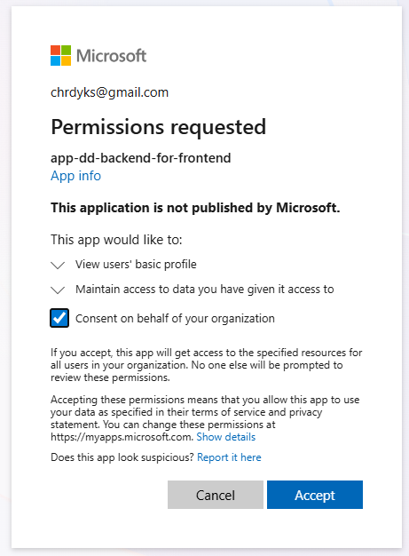

# OIDC terraform

## Setup

have an administrator run `./init.ps1`  This will create the state store backend (a storage account) that terraform uses for the remote state environment and lock

### CI/CD Service Principal

coming soon™️ to a readme near you
- specific question: what are the roles (see if there are standard defaults) that the service principal should have

### local development

the variable `dev_group_members` will grant access for the environment being created to do all the same things that the applications are granted permissions to do e.g. read from Azure App Config e.g. download the certificate used to prove app identity to Entra for OBO authorization flows.

### admin consent

When a user first logs into one of the front ends they will be asked to consent to the app registration scope, which should require only minimal information about the user.  Alternatively, an admin can login and grant tenant-wide consent, eliminating this need for consent.  This may take a little while.  In scenarios where users can't consent for some reason the only option is admin consent.  All scopes are configured as admin-only (only an admin can consent) in this terraform configuration.

## running locally

in all cases substitute `local.tfvars` for your real tfvars file targeting the environment you're using

`terraform validate -var-file="local.tfvars"`
`terraform plan -var-file="local.tfvars"` 
`terraform apply -var-file="local.tfvars"` if you have permissions

## The result

- the container apps resources will be created with a placeholder container in them, CI for the app they host will need to fill in the real container after pushing it to the container registry
   - the container app registration in entra and the connections will be set up already
      - client ID and related non-secret configurations will be in Azure App Config for the app to read at startup
      - secrets will be in azure key vault for the app to read at startup e.g. the shared secret with entra for the OBO flow to call a downstream API
- frontend apps will be created as Azure Static Web Apps
   - CI/CD will supply the app bundle to the static web app
      - CI will need to pull non-secret configurations from Azure App Config and supply them to the build/bundle process in a .env.{environment}.auth file
         - e.g. `vite build --mode staging` will read from the files `.env`, `.env.staging`, `.env.staging.auth` to supply configuration to the SPA code